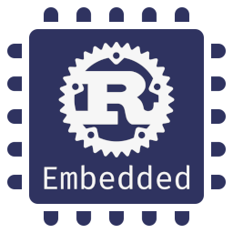

# Embedded devices Working Group

> Coordination repository of the embedded devices Working Group (WG)

This repository [issue tracker] is used by the embedded WG to coordinate efforts towards making Rust
a great choice for embedded development.

[issue tracker]: https://github.com/rust-embedded/wg/issues

**Want to get started with embedded development with Rust?** Check out our
[embedded Rust book][book] and the rest of our [bookshelf].

Want to stay up-to-date with community progress? Check out our [newsletter].

Join the discussion on Matrix! [#rust-embedded:matrix.org][matrix]

[book]: https://docs.rust-embedded.org/book
[bookshelf]: https://docs.rust-embedded.org
[newsletter]: https://rust-embedded.github.io/blog/
[matrix]: https://matrix.to/#/#rust-embedded:matrix.org

## Vision

What is it that we really want? At a broad level:

- To improve the absolute quality (functionality, safety, performance) of embedded software in the
  wild.
- To improve the productivity of embedded software development teams, by reducing the tangible and
  intangible costs of achieving a level of quality.
- To improve the experience for programmers developing for embedded systems.
- To make embedded systems programming more accessible for people that are not already embedded
  systems developers.

## What we do

At a high level we have two main tasks:

*We work with the community to improve the embedded ecosystem.*

- We maintain and develop core crates in the embedded ecosystem ensuring that the development
  roadmap aligns with the needs of its users. You can find all the crates we maintain in the
  [Organization](#organization) section.

- We develop and curate resources about embedded Rust development. Check our
  [bookshelf]!

- We maintain and moderate the venues the embedded community uses to discuss. That includes this
  coordination repository and our [Matrix room][matrix].

And, we serve as a bridge between the [Rust teams] and the embedded community.

[Rust teams]: https://www.rust-lang.org/team.html

## How you can help

Everyone can contribute to the embedded WG efforts! There are several ways to help out:

- [Let us know] where the gaps are. If you think the language, the compiler, the tooling, the
  documentation or the crate ecosystem is lacking some feature, information or library to build
  embedded software let us know and we'll bring it up to the Rust teams or organize the community to
  build the crates or tools to fill the gaps.

[Let us know]: https://github.com/rust-embedded/wg/issues

- Participate in [RFC (Request For Comments)][rfc] threads. We are always looking into ways to
  improve. This may involve things from changing how we run the WG to landing major breaking changes
  in core crates. To ensure we are *actually* making things better we need your input! That's why
  all these changes are preceded by an "RFC", a discussion thread (which may or may not be backed by
  a proper RFC document) where we evaluate the pros and cons of a proposal and explore alternatives.
  Only after there's consensus on accepting the proposal is the proposal made effective.

[rfc]: https://github.com/search?q=org%3Arust-embedded+is%3Aopen+label%3Arfc&type=Issues

- [Help wanted!]. There's always lots to do but the WG members only have so much free time. You can
  help us fixing bugs, implementing features, writing tests, trying out examples and tutorials,
  writing documentation, fixing typos, etc. We'll mentor you through these tasks and review your
  work. In some cases you may not even need previous embedded experience or access embedded hardware
  to help us out so don't let that discourage you from checking out our help wanted issues.

[Help wanted!]: https://github.com/search?q=org%3Arust-embedded+is%3Aopen+label%3A%22help+wanted%22&type=Issues

- Join our weekly meetings on [Matrix][matrix]. We use these meetings as a faster, synchronous alternative to the
  RFC threads on GitHub. The agenda is posted in the matrix channel in advance
  to the meeting. Everyone is free to join the meeting and share their thoughts. You can also
  nominate an existing GH thread for discussion if you think it would benefit from a more
  synchronous discussion.
  The usual meeting time is Tuesdays, 8pm CET/CEST.

- We have several teams focused on different areas: tooling, Cortex-M crates, etc. and each team
  maintains several projects (crates, docs and / or tools) that live under the [rust-embedded]
  organization. You can collaborate with the maintenance and development of these projects by
  becoming a project collaborator (consult with the team that owns the project) or by [joining] the
  team.

[rust-embedded]: https://github.com/rust-embedded
[joining]: https://github.com/rust-embedded/wg/blob/master/rfcs/0136-teams.md#adding-new-members

## Organization

The WG is composed of several teams whose functions are defined in [RFC
#136](./rfcs/0136-teams.md). The embedded WG develops and maintains a large set
of projects under the [rust-embedded] organization. This section lists all the
teams and all the projects owned by the WG.

[rust-embedded]: https://github.com/rust-embedded

### The core team

The functions of the core team are:

- Representing the WG in meetings with other [Rust teams].
- Communicating the needs of the embedded Rust community (e.g. language features, `core` API
  stabilization) to the Rust teams.
- Giving the casting vote on intra-WG decisions where no [voting majority] can be achieved.
- Driving and moderating the weekly meetings.

[Rust teams]: https://www.rust-lang.org/en-US/team.html
[voting majority]: https://github.com/rust-lang-nursery/embedded-wg/blob/master/rfcs/0136-teams.md#voting-majority

#### Members

- [@adamgreig]
- [@therealprof]

### The Cortex-A team

The Cortex-A team develops and maintains the core of the Cortex-A crate ecosystem.

#### Members

- [@raw-bin]
- [@nchong-at-aws]

#### Projects

Projects maintained by this team.

- [`aarch64-cpu`]
- [`rust-raspberrypi-OS-tutorials`]

### The Cortex-M team

The Cortex-M team develops and maintains the core of the Cortex-M crate ecosystem.

#### Members

- [@adamgreig]
- [@therealprof]
- [@thalesfragoso]
- [@thejpster] (Personal) / [@jonathanpallant] (Work)
- [@newAM]

#### Projects

Projects maintained by this team.

- [`cortex-m-quickstart`]
- [`cortex-m-rt`]
- [`cortex-m-semihosting`]
- [`cortex-m`]
- [`itm`]
- [`panic-itm`]
- [`panic-semihosting`]

### The Cortex-R team

The Cortex-R team develops and maintains the core of the Cortex-R crate ecosystem.

#### Members

This team is currently empty! Please get in touch via an issue or the Matrix
chat if you are interested in helping to maintain the Cortex-R crates.

#### Projects

- [`arm-dcc`]
- [`cortex-r`]
- [`panic-dcc`]

### The embedded Linux team

The embedded Linux team develops and maintains the core of the embedded Linux crate ecosystem.

#### Members

- [@eldruin]
- [@nastevens]
- [@posborne]
- [@ryankurte]

#### Projects

Projects maintained by the embedded Linux team

- [`gpio-cdev`]
- [`gpio-utils`]
- [`i2cdev`]
- [`linux-embedded-hal`]
- [`meta-rust-bin`]
- [`spidev`]
- [`sysfs-gpio`]
- [`sysfs-pwm`]

### The HAL team

The HAL team develops and maintains crates containing shared traits and related
code that enables the development of hardware abstraction layers and drivers
which can interoperate across all embedded Rust devices on all architectures.

#### Members

- [@therealprof]
- [@ryankurte]
- [@eldruin]
- [@dirbaio]
- [@MabezDev]

#### Projects

Projects maintained by the HAL team.

- [`embedded-dma`]
- [`embedded-hal`]
- [`nb`]
- [`critical-section`]

### The infrastructure team

The infrastructure team manages our domains, DNS records, e-mail aliases, etc.

#### Members

- [@nastevens]
- [@ryankurte]

#### Projects

Projects maintained by this team

- [`rust-embedded-provisioning`]

### The libs team

The libs team manages library code that is not architecture-specific.

#### Members

- [@dirbaio]
- [@newAM]

#### Projects

Projects maintained by this team

- [`embedded-alloc`]
- [`heapless`]
- [`qemu-exit`]
- [`volatile-register`]

### The MSP430 team

The MS430 team develops and maintains the core of the MSP430 crate ecosystem.

#### Members

- [@cr1901]
- [@YuhanLiin]

#### Projects

Projects maintained by this team

- [`msp430-quickstart`]
- [`msp430-rt`]
- [`msp430`]

### The RISC-V team

The RISC-V team develops and maintains the core of the RISC-V crate ecosystem.

#### Members

- [@almindor]
- [@Disasm]
- [@dkhayes117]
- [@romancardenas]
- [@MabezDev]

#### Projects

Projects maintained by this team

- [`riscv-rust-quickstart`]
- [`riscv-rt`]
- [`riscv`]

### The resources team

The resources team develops, maintains and curates documentation, books, our
social media accounts and websites, and similar resources on embedded Rust.

#### Members

- [@adamgreig]
- [@eldruin]
- [@hargoniX]
- [@jamesmunns]
- [@therealprof]

#### Projects

Projects maintained by the resources team

- [Awesome embedded Rust]
- [The Discovery book]
- [The embedded Rust book]
- [The embedonomicon]
- [@rustembedded twitter]

### The tools team

The tools team maintains and develops software for embedded development
which typically runs on your development machine rather than the
embedded targets themselves.

#### Members

- [@adamgreig]
- [@burrbull]
- [@Emilgardis]
- [@reitermarkus]
- [@ryankurte]
- [@therealprof]
- [@thejpster] / [@jonathanpallant]

#### Projects

Projects maintained by the tools team

- [`cargo-binutils`]
- [`itm`]
- [`svd-parser`]
- [`svd2rust`]

### The triage team

The triage team is charge of keeping PR queues moving; they ensure no PR is left unattended.

#### Members

- [@mathk]

### Hibernating and Alumni

The following alumni have put themselves into the hibernation state, due to being absent or busy for an extended amount of time. See [ops/hibernating.md](https://github.com/rust-embedded/wg/blob/master/ops/hibernating.md).

- [@andre-richter]
- [@awygle]
- [@bradjc]
- [@danc86]
- [@dvc94ch]
- [@dylanmckay]
- [@hannobraun]
- [@ithinuel]
- [@japaric]
- [@jcsoo]
- [@korken89]
- [@laanwj]
- [@paoloteti]
- [@parched]
- [@pftbest]
- [@sekineh]
- [@v-thakkar]
- [@wizofe]

### Contact

Each team can be privately contacted via the following e-mail addresses:

- cortex-m@teams.rust-embedded.org
- cortex-r@teams.rust-embedded.org
- embedded-linux@teams.rust-embedded.org
- hal@teams.rust-embedded.org
- infrastructure@teams.rust-embedded.org
- resources@teams.rust-embedded.org
- risc-v@teams.rust-embedded.org
- tools@teams.rust-embedded.org
<!-- - msp430@teams.rust-embedded.org -->

You can usually find the members of the embedded WG on the Rust Embedded Matrix room
([#rust-embedded:matrix.org][matrix]).

Our Matrix room is logged by on the bridged IRC channel, and you can find the logs at: https://libera.irclog.whitequark.org/rust-embedded/

[@Disasm]: https://github.com/Disasm
[@Emilgardis]: https://github.com/Emilgardis
[@adamgreig]: https://github.com/adamgreig
[@almindor]: https://github.com/almindor
[@andre-richter]: https://github.com/andre-richter
[@awygle]: https://github.com/awygle
[@burrbull]: https://github.com/burrbull
[@bradjc]: https://github.com/bradjc
[@cr1901]: https://github.com/cr1901
[@danc86]: https://github.com/danc86
[@dvc94ch]: https://github.com/dvc94ch
[@dirbaio]: https://github.com/Dirbaio
[@dylanmckay]: https://github.com/dylanmckay
[@eldruin]: https://github.com/eldruin
[@hannobraun]: https://github.com/hannobraun
[@hargoniX]: https://github.com/hargoniX
[@ithinuel]: https://github.com/ithinuel
[@jamesmunns]: https://github.com/jamesmunns
[@japaric]: https://github.com/japaric
[@jcsoo]: https://github.com/jcsoo
[@korken89]: https://github.com/korken89
[@laanwj]: https://github.com/laanwj
[@MabezDev]: https://github.com/MabezDev
[@mathk]: https://github.com/mathk
[@nastevens]: https://github.com/nastevens
[@nchong-at-aws]: https://github.com/nchong-at-aws
[@paoloteti]: https://github.com/paoloteti
[@parched]: https://github.com/parched
[@pftbest]: https://github.com/pftbest
[@posborne]: https://github.com/posborne
[@raw-bin]: https://github.com/raw-bin
[@reitermarkus]: https://github.com/reitermarkus
[@romancardenas]: https://github.com/romancardenas
[@ryankurte]: https://github.com/ryankurte
[@sekineh]: https://github.com/sekineh
[@thalesfragoso]: https://github.com/thalesfragoso
[@thejpster]: https://github.com/thejpster
[@jonathanpallant]: https://github.com/jonathanpallant
[@therealprof]: https://github.com/therealprof
[@v-thakkar]: https://github.com/v-thakkar
[@wizofe]: https://github.com/wizofe
[@dkhayes117]: https://github.com/dkhayes117
[@YuhanLiin]: https://github.com/YuhanLiin
[@newAM]: https://github.com/newAM

[@rustembedded twitter]: https://twitter.com/rustembedded
[Awesome embedded Rust]: https://github.com/rust-embedded/awesome-embedded-rust
[The Discovery book]: https://github.com/rust-embedded/discovery
[The embedded Rust book]: https://github.com/rust-embedded/book
[The embedonomicon]: https://github.com/rust-embedded/embedonomicon
[`embedded-alloc`]: https://github.com/rust-embedded/embedded-alloc
[`arm-dcc`]: https://github.com/rust-embedded/arm-dcc
[`cargo-binutils`]: https://github.com/rust-embedded/cargo-binutils
[`aarch64-cpu`]: https://github.com/rust-embedded/aarch64-cpu
[`cortex-m-quickstart`]: https://github.com/rust-embedded/cortex-m-quickstart
[`cortex-m-rt`]: https://github.com/rust-embedded/cortex-m/tree/master/cortex-m-rt
[`cortex-m-semihosting`]: https://github.com/rust-embedded/cortex-m/tree/master/cortex-m-semihosting
[`cortex-m`]: https://github.com/rust-embedded/cortex-m
[`cortex-r`]: https://github.com/rust-embedded/cortex-r
[`embedded-hal`]: https://github.com/rust-embedded/embedded-hal
[`gpio-cdev`]: https://github.com/rust-embedded/gpio-cdev
[`gpio-utils`]: https://github.com/rust-embedded/gpio-utils
[`heapless`]: https://github.com/rust-embedded/heapless
[`i2cdev`]: https://github.com/rust-embedded/rust-i2cdev
[`itm`]: https://github.com/rust-embedded/itm
[`linux-embedded-hal`]: https://github.com/rust-embedded/linux-embedded-hal
[`meta-rust-bin`]: https://github.com/rust-embedded/meta-rust-bin
[`msp430-quickstart`]: https://github.com/pftbest/msp430-quickstart
[`msp430-rt`]: https://github.com/pftbest/msp430-rt
[`msp430`]: https://github.com/pftbest/msp430
[`nb`]: https://github.com/rust-embedded/nb
[`panic-dcc`]: https://github.com/rust-embedded/arm-dcc/tree/master/panic
[`panic-itm`]: https://github.com/rust-embedded/cortex-m/tree/master/panic-itm
[`panic-semihosting`]: https://github.com/rust-embedded/cortex-m/tree/master/panic-semihosting
[`qemu-exit`]: https://github.com/rust-embedded/qemu-exit
[`riscv-rt`]: https://github.com/rust-embedded/riscv-rt
[`riscv-rust-quickstart`]: https://github.com/riscv-rust/riscv-rust-quickstart
[`riscv`]: https://github.com/rust-embedded/riscv
[`rust-embedded-provisioning`]: https://github.com/rust-embedded/rust-embedded-provisioning
[`rust-raspberrypi-OS-tutorials`]: https://github.com/rust-embedded/rust-raspberrypi-OS-tutorials
[`spidev`]:https://github.com/rust-embedded/rust-spidev
[`svd-parser`]: https://github.com/rust-embedded/svd
[`svd2rust`]: https://github.com/rust-embedded/svd2rust
[`sysfs-gpio`]: https://github.com/rust-embedded/rust-sysfs-gpio
[`sysfs-pwm`]: https://github.com/rust-embedded/rust-sysfs-pwm
[`volatile-register`]: https://github.com/rust-embedded/volatile-register
[`embedded-dma`]: https://github.com/rust-embedded/embedded-dma
[`critical-section`]: https://github.com/rust-embedded/critical-section

## Other projects

These are other projects you may be interested in but that (currently) are not owned by the WG.

- [AVR fork of Rust](https://github.com/avr-rust/)
- [Xtensa fork of Rust (for Espressif chips)](https://github.com/esp-rs/rust)

## Ongoing community efforts

### Device specific communities

Several device specific communities exist that are not part of the working group.
These communities maintain crates for peripheral access, hardware abstraction,
examples, and more that are specific to a particular family of devices.
The list below is not exhaustive and will be updated as device support increases.

- [nrf-rs](https://github.com/nrf-rs): Nordic nRF series of microcontrollers
- [stm32-rs](https://github.com/stm32-rs): STM32 microcontrollers
- [lpc-rs](https://github.com/lpc-rs): NXP LPC microcontrollers
- [imxrt-rs](https://github.com/imxrt-rs): NXP i.MX RT microcontrollers
- [esp-rs](https://github.com/esp-rs): Espressif Systems microcontrollers
- [rp-rs](https://github.com/rp-rs): Raspberry Pi microcontrollers including the RP2040

### [`embedded-hal`]

[`embedded-hal`]: https://github.com/rust-embedded/embedded-hal

`embedded-hal` is a project that aims to build a standard set of traits (interfaces) for I/O
functionality common in embedded devices: Serial, I2C, etc. with the goal of serving as a base for
building reusable driver crates, crates to interface with external components like sensors.

There are plenty of traits that still need to be designed, in particular ones that involve async
I/O. Join the discussion and help us design the missing traits so that they'll fulfill your needs.

### [The weekly driver initiative][wd]

To put the `embedded-hal` to test and to expand the embedded crates.io ecosystem we are running the
weekly driver initiative. The goal is to release a new `no_std`, generic, `embedded-hal` driver
crate every one or two weeks.

There's lots of cool devices that would be great to have drivers for. Join the initiative and help
us grow the embedded crates.io ecosystem!

[wd]: https://github.com/rust-lang-nursery/embedded-wg/issues/39

### [Awesome embedded Rust](https://github.com/rust-embedded/awesome-embedded-rust)

The community is building a curated list of crates useful for embedded development. In this list
you'll find driver crates, board support crates and general purpose no-std crates. Help us improve
this list by adding your crate via PR or by tackling any of our [help wanted][aer-hw] issues.

[aer-hw]: https://github.com/rust-embedded/awesome-embedded-rust/issues?q=is%3Aissue+is%3Aopen+label%3A%22help+wanted%22

### [Embedded category in the user forum][ef]

As an experiment the [Rust lang user forum][urlo] has gained a new `embedded` category.

This is meant as a friendly exchange for anyone interested in embedded topics with Rust.

So if you want to discuss ideas, problems or solutions please feel free to chime in on existing topics or create a new one!

[urlo]: https://users.rust-lang.org
[ef]: https://users.rust-lang.org/c/embedded

## RFCs

When the team deems it necessary the RFC process may be used to make decisions or to design
processes, user interfaces, APIs, etc.

Learn more about the Rust's RFC process (which is the same as our own) [here][rust-rfc].

[rust-rfc]: https://rust-lang.github.io/rfcs/

To create an RFC, simply:
- clone this repo to your own personal one
- copy `0000-template.md` to `text/0000-my-feature.md` (where "my-feature" is
  descriptive. Don't assign an RFC number yet)
- fill in the details of your RFC in that file
- Open an pull request with this repository
